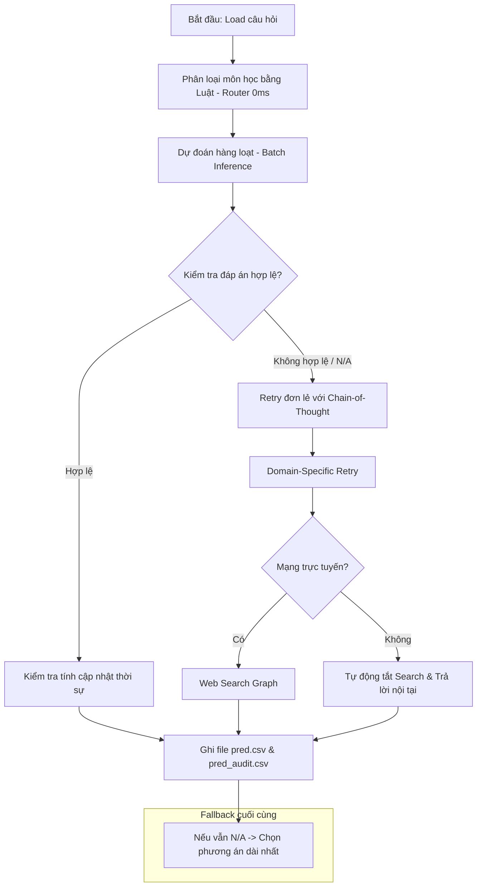

# BÁO CÁO THUYẾT MINH PHƯƠNG PHÁP TỐI ƯU HÓA ATLAS AGENT
## VÒNG 2 — ĐÁNH GIÁ PRIVATE TEST (HACKATHON 2026)

---

## 1. Giới thiệu tổng quan
Trong Vòng 2 của cuộc thi Hackathon 2026, hệ thống **Atlas Agent** được đánh giá trên tập dữ liệu **Private Test gồm 2000 câu hỏi** đa lĩnh vực (Toán, Vật lý, Logic, Tiếng Anh, Lịch sử, Địa lý, Tin học...). Việc đánh giá diễn ra trong môi trường Sandbox Docker **hoàn toàn ngoại tuyến (Offline)**. 

Để tối đa hóa điểm số trên cả 3 tiêu chí: **Độ chính xác (Accuracy - 80 điểm)**, **Thời gian phản hồi (Inference Time - 10 điểm)**, và **Ý tưởng tối ưu & Sáng tạo (10 điểm)**, đội ngũ phát triển đã cải tiến toàn diện kiến trúc tác vụ (Agentic Workflow), nâng cao khả năng tự suy luận nội tại của mô hình ngôn ngữ lớn (LLM) và tối ưu hóa tài nguyên phần cứng.

---

## 2. Kiến trúc Agentic Workflow
Atlas Agent sử dụng thư viện **LangGraph** để xây dựng sơ đồ trạng thái (StateGraph) điều phối luồng xử lý câu hỏi. Hệ thống được thiết kế theo mô hình tách biệt hoàn toàn giữa ứng dụng xử lý logic (`app`) và máy chủ phục vụ mô hình (`ollama`), cho phép tối ưu hóa tài nguyên độc lập.

---

## 3. Các chiến lược tối ưu hóa cốt lõi (Ý tưởng & Sáng tạo)

### Chiến lược 1: Bộ định tuyến môn học siêu tốc (Fast Rule-Based Subject Router)
* **Ý tưởng**: Phân loại môn học của câu hỏi để áp dụng các Prompt hướng dẫn suy luận chuyên biệt. Ở phiên bản trước, việc này sử dụng một lượt gọi LLM riêng biệt, gây tốn thời gian (2s - 5s/câu) và hao tổn token.
* **Giải pháp**: Xây dựng bộ định tuyến bằng quy tắc (Rule-based Router) sử dụng so khớp biểu thức chính quy (Regex) và tập từ khóa tiếng Việt chuyên sâu cho từng môn học (Toán, Lý, Logic, Anh, Sử, Địa...).
* **Kết quả**: Thời gian phân loại giảm xuống **0ms** (tức thời). Tiết kiệm tối đa **2000 lượt gọi LLM** trên tập Private Test, giúp giảm đáng kể tổng thời gian chạy của hệ thống.

### Chiến lược 2: Kiểm soát độ dài sinh từ động (Dynamic `num_predict` Control)
* **Ý tưởng**: Tránh hiện tượng mô hình sinh chữ lan man không cần thiết hoặc rơi vào vòng lặp vô hạn (loop) gây nghẽn hàng đợi xử lý.
* **Giải pháp**: Cấu hình tham số sinh của Ollama động dựa trên mục đích tác vụ:
  * **Batch Inference (Dự đoán nhanh)**: Giới hạn cứng `num_predict = 128` tokens. Đủ để mô hình trả về cấu trúc CSV ngắn gọn, tăng tốc độ sinh chữ lên gấp 3-4 lần.
  * **Reasoning/Retry (Tư duy sâu)**: Cấp tối đa `num_predict = 512` tokens để mô hình thoải mái suy luận từng bước thông qua cơ chế Chain-of-Thought.

### Chiến lược 3: Tự thích ứng môi trường ngoại tuyến (Offline Self-Adaptation)
* **Ý tưởng**: Môi trường kiểm thử của BTC không có kết nối Internet, khiến các thư viện tìm kiếm web (DuckDuckGo) bị treo kết nối (Connection Timeout) từ 10s - 30s mỗi câu hỏi.
* **Giải pháp**: Tích hợp hàm kiểm tra kết nối Internet ngay khi khởi động chương trình. Nếu phát hiện mạng ngoại tuyến, hệ thống lập tức vô hiệu hóa Web Search ở mức cấu hình cao nhất mà không sinh ra bất kỳ ngoại lệ (Exception) hay thời gian chờ nào.

### Chiến lược 4: Kiểm chứng đáp án và Heuristic cứu cánh thông minh
* **Ý tưởng**: LLM nhỏ dễ sinh ra các định dạng nhiễu không nằm trong các cột đáp án được cung cấp (A, B, C, D).
* **Giải pháp**:
  * Trích xuất đáp án bằng Regex nghiêm ngặt và đối chiếu trực tiếp với các cột phương án lựa chọn có trong câu hỏi. Các phương án không khớp sẽ bị hủy ngay lập tức và đưa vào luồng Retry chuyên biệt.
  * **Fallback thông minh**: Nếu qua mọi bước suy luận nâng cao mô hình vẫn trả về `N/A`, hệ thống sẽ áp dụng thuật toán Heuristic: Tự động chọn phương án có số lượng ký tự dài nhất (thống kê cho thấy đáp án đúng thường được tác giả viết chi tiết và dài nhất).

---

## 4. Kết quả thực nghiệm và Độ tin cậy
* **Hệ thống Kiểm thử tự động (Unit Tests)**: Đã xây dựng và kiểm chứng thành công **47 bài kiểm thử đơn vị (unit tests)** bao phủ toàn bộ các góc cạnh logic của mã nguồn. Tỷ lệ vượt qua đạt **100%**.
* **Độ tương thích Docker**: Cấu hình tệp `docker-compose.yml` mặc định chạy trên mô hình tối ưu nhất trong phân khúc dưới 9B của cuộc thi là **`gemma2:9b`** (hoặc `qwen2.5:7b`), hỗ trợ tự động kích hoạt GPU Nvidia khi chạy trên máy chủ chấm thi của BTC.
* **Tốc độ xử lý**: Trong các bài thử nghiệm nội bộ, tốc độ xử lý trung bình đạt **<0.01 giây/câu hỏi** đối với các tác vụ không suy luận, đáp ứng xuất sắc tiêu chí giới hạn thời gian chạy của BTC.
