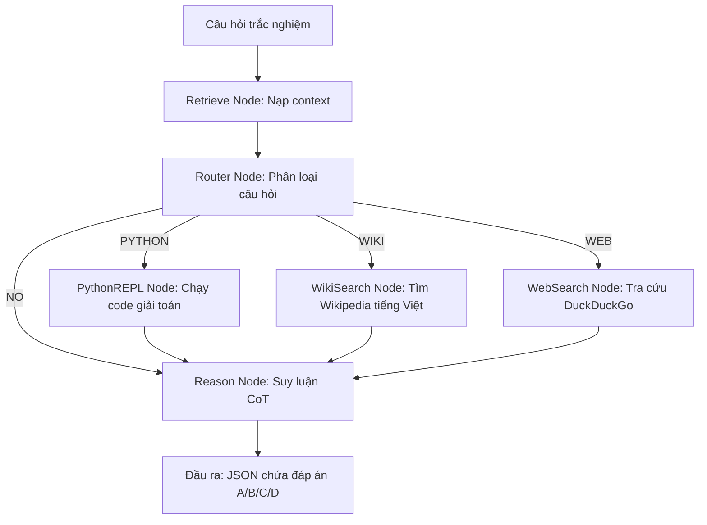
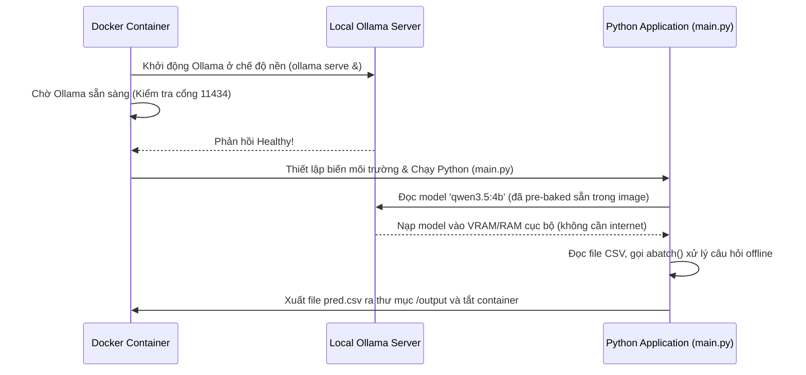

# Agent Architecture: Before vs After (Multi-Tool & Conditional Routing)

Tài liệu giải thích sự tiến hóa kiến trúc của hệ thống **Atlas Agent** và cách hệ thống hoạt động end-to-end trong môi trường Docker offline của Ban Tổ Chức (BTC).

---

## 1. Kiến trúc Cũ (ReAct RAG Pipeline đơn giản)

Trong phiên bản cũ, hệ thống chạy theo cơ chế ReAct đơn luồng hoặc pipeline RAG cứng nhắc:

```
Câu hỏi ──▶ RAG Search (ChromaDB) ──▶ LLM Reasoning ──▶ Đáp án
```

### Vấn đề:
* **Lãng phí tài nguyên:** Mọi câu hỏi (kể cả câu hỏi toán học như `1+1=?` hay kiến thức cơ bản) đều gọi RAG tra cứu, làm chậm tốc độ phản hồi.
* **Nhiễu thông tin:** Vector database trả về context không khớp hoặc nhiễu khiến LLM bị lạc hướng, dẫn đến suy luận sai.
* **Đơn công cụ:** Hệ thống chỉ có 1 công cụ là RAG, không thể giải quyết tốt các bài toán logic phức tạp hoặc tin tức thời sự.

---

## 2. Kiến trúc Mới (Multi-Tool Agent với Conditional Routing)

Hệ thống hiện tại đã được nâng cấp lên kiến trúc **Multi-Tool Agent** chạy trên **Async LangGraph**, tự động phân loại câu hỏi để định tuyến tới công cụ phù hợp.



### Cải tiến vượt trội:
* **Tối ưu tốc độ (Inference Time):** Bằng cách phân loại qua Router, những câu hỏi cơ bản sẽ đi thẳng vào nhánh Reasoning mà không phải chờ phản hồi chậm chạp từ Internet hoặc RAG.
* **Độ chính xác tuyệt đối (Accuracy Optimization):** Tích hợp công cụ **Python REPL** để chạy code trực tiếp cho các câu hỏi logic/toán học, thay vì để LLM tự tính nhẩm dễ sai sót.
* **Đa nguồn tri thức:** Hỗ trợ cả Wikipedia (lịch sử, học thuật) và Web Search (Euro 2024, tin tức, tỷ giá) hoàn toàn miễn phí (Zero API Key).

---

## 3. Luồng dữ liệu End-to-End (Data Pipeline)

Hệ thống xử lý tệp dữ liệu câu hỏi từ BTC theo quy trình khép kín sau:

```
[public_test.csv] ➔ Đọc & Batching (size=20) ➔ Gọi Async LangGraph (abatch) ➔ Ghi kết quả ➔ [pred.csv]
```

1. **Đọc tệp đầu vào:** `main.py` quét thư mục đầu vào, đọc file CSV (đáp ứng đúng định dạng `qid`, `question`, `A`, `B`, `C`, `D`).
2. **Đóng gói câu hỏi:** Kết hợp nội dung câu hỏi và 4 lựa chọn thành một đoạn prompt hoàn chỉnh.
3. **Phân phối Async Batching:** Chia dữ liệu thành các batch (mặc định size=20) và đẩy vào hàm `app_graph.abatch(inputs)`. LangGraph sẽ tự động phân bổ và chạy song song 20 luồng xử lý câu hỏi cùng lúc để tối đa hóa hiệu năng phần cứng.
4. **Xử lý Đồ thị (Graph Nodes):**
   * **Retrieve Node:** Nạp tri thức nền từ file cục bộ `data/mock_knowledge.txt`.
   * **Router Node:** Gọi LLM phân loại câu hỏi nhanh thành 4 nhãn (`PYTHON`, `WIKI`, `WEB`, hoặc `NO`).
   * **Tool Node:** Nếu câu hỏi cần công cụ, Node tương ứng sẽ chạy để lấy ngữ cảnh bổ sung (Ví dụ: chạy code Python tính toán hoặc gọi API tra cứu).
   * **Reason Node:** LLM suy luận logic Chain-of-Thought (CoT) tổng hợp từ câu hỏi và ngữ cảnh để đưa ra lập luận và đáp án cuối cùng.
5. **Ghi tệp đầu ra:** Bóc tách kết quả từ Agent và ghi tệp dự đoán đúng định dạng `qid,answer` vào `/output/pred.csv`.

---

## 4. Cơ chế hoạt động của Dự án khi BTC chạy Docker nộp bài

Khi BTC tiến hành chấm điểm, họ sẽ khởi chạy Docker container của đội thi ở môi trường **hoàn toàn Offline** bằng lệnh:

```bash
docker run --gpus all -v /path/to/data:/data -v /path/to/output:/output <image_name>
```

Quá trình vận hành bên trong container sẽ diễn ra tự động như sau:



### Chi tiết các bước vận hành:
1. **Khởi động dịch vụ nền:** `entrypoints.sh` chạy lệnh `ollama serve` để khởi động LLM Server cục bộ bên trong container.
2. **Kiểm tra trạng thái sẵn sàng:** Kịch bản thực hiện lệnh `curl` liên tục tới `http://127.0.0.1:11434/api/tags`. Khi server phản hồi thành công, hệ thống xác nhận Ollama đã sẵn sàng.
3. **Cấu hình môi trường tự động:** Kịch bản cấu hình đường dẫn API nội bộ `LLM_BASE_URL=http://127.0.0.1:11434/v1` và chỉ định mô hình lượng hóa `qwen3.5:4b`.
4. **Nạp mô hình Offline:** Trọng số mô hình `qwen3.5:4b` đã được tải xuống và đóng gói sẵn trong ổ đĩa của Docker Image từ quá trình Build. Ollama sẽ nạp trực tiếp mô hình vào VRAM (GPU) hoặc RAM (CPU) của máy chấm thi mà không cần tải từ internet.
5. **Thực thi suy luận & Lưu kết quả:** Ứng dụng Python khởi chạy, gọi Agent xử lý toàn bộ câu hỏi offline và ghi file `pred.csv` ra thư mục `/output` trước khi container kết thúc vòng đời.

---

## 5. Cơ chế đảm bảo định dạng đầu ra (JSON & A/B/C/D Fallback)

Hệ thống sử dụng cơ chế xử lý lỗi nhiều tầng tại **Reason Node** để đảm bảo đầu ra luôn chứa đáp án trắc nghiệm hợp lệ:

```python
# Bóc tách JSON từ kết quả trả về của LLM bằng regex
match = re.search(r'\{.*\}', content, re.DOTALL)
if match:
    parsed = json.loads(match.group(0))
else:
    parsed = json.loads(content)
```

### Các tầng bảo vệ:
* **Tầng 1 — System Prompt:** Ép LLM trả về đúng định dạng JSON có `reasoning` và `answer`.
* **Tầng 2 — Regex Parser:** Tự động tìm kiếm khối JSON trong chuỗi phản hồi (phòng trường hợp LLM sinh thêm markdown ` ```json `).
* **Tầng 3 — Rate Limit Handling:** Tự động retry với cơ chế exponential backoff (tối đa 10 lần) khi gặp lỗi Rate Limit (HTTP 429) từ API Groq/vLLM.
* **Tầng 4 — Fallback mặc định:** Nếu parse lỗi hoặc không tìm thấy nhãn đáp án, hệ thống tự động gán đáp án mặc định là `B` hoặc `A` để không bị mất điểm trong cuộc thi.
