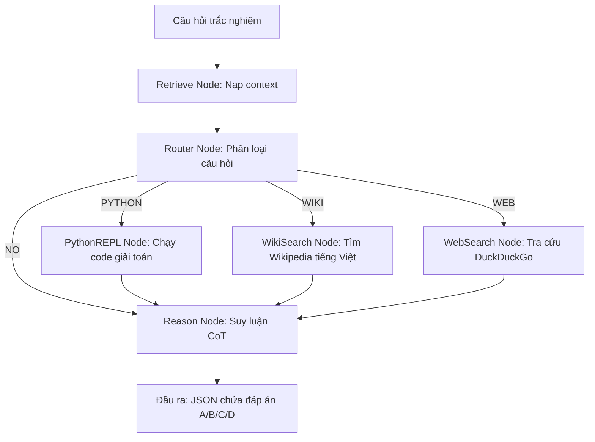

# Agent Architecture: Before vs After (Multi-Tool & Conditional Routing)

Tài liệu giải thích sự tiến hóa kiến trúc của hệ thống **Atlas Agent** trước và sau khi cải tiến sang mô hình Multi-Tool với phân loại thông minh (Conditional Routing).

---

## 1. Kiến trúc Cũ (ReAct RAG Pipeline đơn giản)

Trong phiên bản cũ, hệ thống chạy theo cơ chế ReAct đơn luồng hoặc pipeline RAG cứng nhắc:

```
Câu hỏi ──▶ RAG Search (ChromaDB) ──▶ LLM Reasoning ──▶ Đáp án
```

### Vấn đề:
* **Lãng phí tài nguyên:** Mọi câu hỏi (kể cả câu hỏi toán học như `1+1=?` hay kiến thức cơ bản) đều gọi RAG tra cứu, làm chậm tốc độ phản hồi.
* **Nhiễu thông tin:** Vector database trả về context không khớp hoặc nhiễu khiến LLM bị lạc hướng, dẫn đến suy luận sai.
* **Đơn công cụ:** Hệ thống chỉ có 1 công cụ là RAG, không thể giải quyết tốt các bài toán logic phức tạp hoặc tin tức thời sự.

---

## 2. Kiến trúc Mới (Multi-Tool Agent với Conditional Routing)

Hệ thống hiện tại đã được nâng cấp lên kiến trúc **Multi-Tool Agent** chạy trên **Async LangGraph**, tự động phân loại câu hỏi để định tuyến tới công cụ phù hợp.



### Cải tiến vượt trội:
* **Tối ưu tốc độ (Inference Time):** Bằng cách phân loại qua Router, những câu hỏi cơ bản sẽ đi thẳng vào nhánh Reasoning mà không phải chờ phản hồi chậm chạp từ Internet hoặc RAG.
* **Độ chính xác tuyệt đối (Accuracy Optimization):** Tích hợp công cụ **Python REPL** để chạy code trực tiếp cho các câu hỏi logic/toán học, thay vì để LLM tự tính nhẩm dễ sai sót.
* **Đa nguồn tri thức:** Hỗ trợ cả Wikipedia (lịch sử, học thuật) và Web Search (Euro 2024, tin tức, tỷ giá) hoàn toàn miễn phí (Zero API Key).

---

## 3. Luồng xử lý chi tiết (Pipeline Nodes)

1. **Retrieve Node:** Tiếp nhận câu hỏi và nạp tri thức nền từ file cục bộ `data/mock_knowledge.txt`.
2. **Router Node:** Gọi LLM đọc nhanh câu hỏi để phân loại thành 4 nhãn:
   * `PYTHON`: Các câu hỏi Toán học, logic, dãy số.
   * `WIKI`: Lịch sử, địa lý, định nghĩa học thuật.
   * `WEB`: Thời sự, thể thao, tin tức mới nhất.
   * `NO`: Kiến thức phổ thông thông thường.
3. **Tool Nodes:**
   * **PythonREPL Node:** LLM tự sinh mã Python ➔ Thực thi code bằng thư viện `langchain_experimental` ➔ Trả về kết quả đầu ra chính xác.
   * **WikiSearch Node:** LLM trích xuất từ khóa ngắn gọn ➔ Gọi API Wikipedia (tiếng Việt) ➔ Lấy tóm tắt 3 câu.
   * **WebSearch Node:** Thực hiện tìm kiếm web nhanh qua DuckDuckGo ➔ Lấy 3 kết quả hàng đầu.
4. **Reason Node (Reasoning):** Tích hợp prompt Chain-of-Thought (CoT) để lập luận dựa trên câu hỏi và context bổ sung từ Tool, bóc tách kết quả trực tiếp ra JSON.

---

## 4. Cơ chế đảm bảo định dạng đầu ra (JSON & A/B/C/D Fallback)

Hệ thống sử dụng cơ chế xử lý lỗi nhiều tầng tại **Reason Node** để đảm bảo đầu ra luôn chứa đáp án trắc nghiệm hợp lệ:

```python
# Bóc tách JSON từ kết quả trả về của LLM bằng regex
match = re.search(r'\{.*\}', content, re.DOTALL)
if match:
    parsed = json.loads(match.group(0))
else:
    parsed = json.loads(content)
```

### Các tầng bảo vệ:
* **Tầng 1 — System Prompt:** Ép LLM trả về đúng định dạng JSON có `reasoning` và `answer`.
* **Tầng 2 — Regex Parser:** Tự động tìm kiếm khối JSON trong chuỗi phản hồi (phòng trường hợp LLM sinh thêm markdown ` ```json `).
* **Tầng 3 — Rate Limit Handling:** Tự động retry với cơ chế exponential backoff (tối đa 10 lần) khi gặp lỗi Rate Limit (HTTP 429) từ API Groq/vLLM.
* **Tầng 4 — Fallback mặc định:** Nếu parse lỗi hoặc không tìm thấy nhãn đáp án, hệ thống tự động gán đáp án mặc định là `B` hoặc `A` để không bị mất điểm trong cuộc thi.
